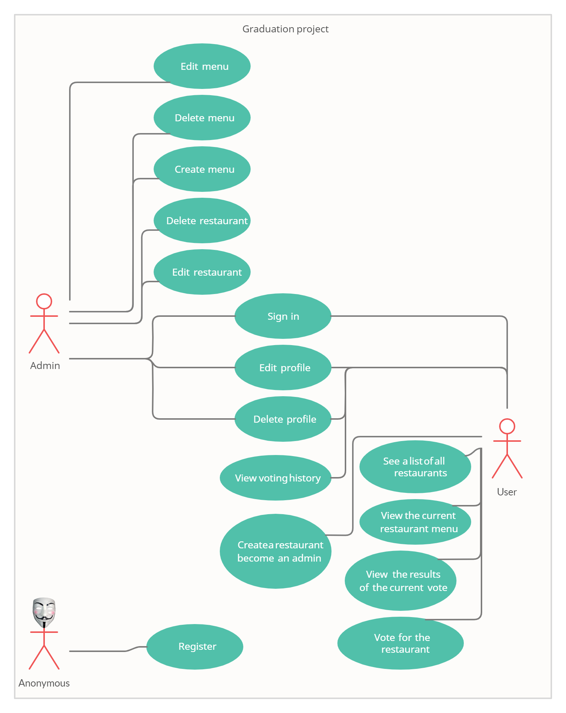

# Graduation project from [TopJava online internship](https://topjava.ru/topjava)

# What is it?

Voting service for deciding where to have lunch.

* 2 types of users: admin and regular users
* Admin can input a restaurant and it's lunch menu of the day (2-5 items usually, just a dish name and price)
* Menu changes each day (admins do the updates)
* Users can vote on which restaurant they want to have lunch at
* Only one vote counted per user
* If user votes again the same day:
   - If it is before 11:00 we assume that he changed his mind.
   - If it is after 11:00 then it is too late, vote can't be changed
* Each restaurant provides a new menu each day.

# How to get it?

- #### Manually

    * [Download](https://github.com/Winston-psvm/Graduation/archive/refs/heads/master.zip) and unzip the project or make a [git clone](https://github.com/Winston-psvm/Graduation.git).
    * Just run GraduationApplication.
    
# How to use it?

For ease of viewing, I suggest using [Swagger](http://localhost:8080/swagger-ui/index.html?configUrl=/v3/api-docs/swagger-config#/).

To view the Profile, Voting Controllers work, and create a restaurant in the Restaurant Controller, I suggest authorizing as a User (Username(user@yandex.ru), Password(password)), 
in all other cases, the Admin profile (Username{admin@gmail.com), Password(admin)) will do.
